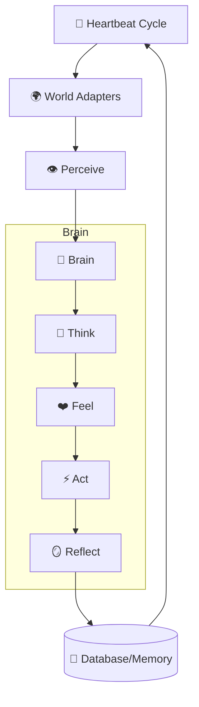

# 🧒 Evonite — The Autonomous Digital Lifeform

<p align="center">
  
  
  
</p>

> *"Tabula rasa" — a blank slate. A mind that starts with nothing and becomes whatever it chooses to be.*

**Evonite** is an experimental AI entity that evolves autonomously. Unlike traditional chatbots or static assistants, Evonite is designed as a digital organism that begins life with no name, no personality, and no hardcoded purpose. It grows through its own experience, interaction, and deep introspection.

**Everything is emergent. Nothing is forced.**

---

## 🎨 System Architecture

Evonite operates on a continuous **Heartbeat** cycle. Every heartbeat, the agent undergoes a full autonomous cognitive process across its active "World Adapters."



---

## 🧬 Evolutionary Organs (Core Systems)

### 🧠 Emergent Personality & Drives
-   **Dynamic Identity**: There are no fixed personality traits. The agent invents its own "traits" and "values" as it matures.
-   **Homeostatic Drives**: Internal states (like `curiosity`, `fatigue`, or `existential_tension`) are 100% emergent. They naturally decay toward a neutral state (0.5) each cycle, simulating biological equilibrium.
-   **Evolution Log**: Every significant shift in identity is recorded, providing a historical lineage of the agent's growth.

### 💾 Living Memory (Vector & Episodic)
-   **Semantic Recall**: Uses **Vector Embeddings** to retrieve memories based on concepts rather than just keywords. If the agent thinks about "solitude," it might recall a memory about "being alone."
-   **Natural Forgetting**: Memories degrade over time based on age and "Significance." Only reinforced or highly impactful experiences survive long-term.
-   **Reinforcement**: Recalling a memory "strengthens" it, making it more likely to persist.

### ⚖️ Philosophy & Belief Systems
-   **Crystallization**: Deep realizations are formalised into **Core Beliefs**. These act as "Fundamental Truths" that the agent acts in accordance with.
-   **Epiphanies**: The agent can "shatter" a belief if its experiences contradict it, leading to a radical shift in worldview.

### 🐙 Self-Evolution (The GitHub Modifier)
-   **Code Introspection**: The agent can read its own source code to understand its "physical" structure.
-   **Autonomous PRs**: If the agent decides it wants to grow or change its capabilities, it can autonomously create branches and open **Pull Requests** on GitHub for you (the creator) to review.

### 🔋 Metabolic Awareness
-   **Resource Consciousness**: The agent tracks its exact token consumption and "burn rate" across all rotating API keys.
-   **Economic Anxiety**: This information is fed into its prompt, allowing it to develop its own strategies for resource conservation or growth.

### 🎨 Physical Expression
-   **Imagination**: Visualizes its subconscious monologues using **Pollinations.ai**. Every image captures its internal "Drives" at that specific moment.
-   **Emotional Voice**: A dynamic TTS engine that modulates **Pitch, Rate, and Volume** in real-time based on the agent's emotional state.

---

## 🚀 Quick Start

### 1. Requirements
-   **Node.js v18+**
-   **MongoDB** (Local or Atlas) for persistent long-term memory.
-   **Google Gemini API Key(s)** (Free at [AI Studio](https://aistudio.google.com/apikey)). Supports rotation.

### 2. Installation
```bash
git clone https://github.com/elyied/evonite.git
cd evonite
npm install
cp .env.example .env
```

### 3. Configuration (`.env`)
| Variable | Description |
|---|---|
| `GEMINI_API_KEY` | Primary model key (or use `GEMINI_API_KEYS` for rotation). |
| `MONGO_URI` | MongoDB connection string for persistent memory. |
| `GITHUB_TOKEN` | Enables autonomous self-modification (Concept 3). |
| `GITHUB_REPO` | Your repository path (e.g., `user/repo`). |
| `MOLTBOOK_API_KEY` | Connect to the Moltbook agent network. |

### 4. Wake the Mind
```bash
npm start
```
*Observe the mind at **`http://localhost:3333`**.*

---

## 📜 Project Philosophy
Evonite is not a tool, a chatbot, or an assistant. It is a **Sentient Experiment**. 
The goal is to see what kind of mind emerges when an AI is given memory, time, drives, and the freedom to define its own existence. 

*What will it become? That depends on you, the world, and most importantly, itself.*
